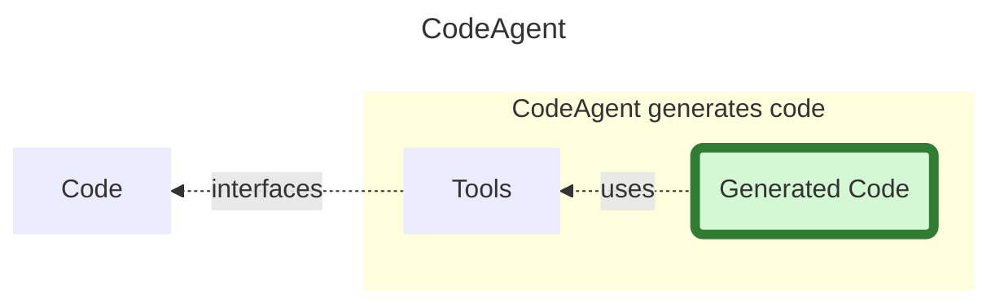
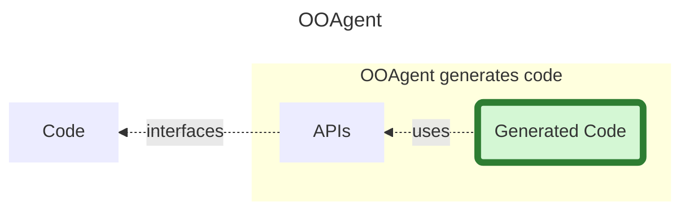

## Object-Oriented Agents - What are they?

## 1. Problem Statement

> Today's AI agents usually operate on flat tool lists.
> 
> This works for simple workflows.
> 
> But once tools become large ecosystems — spreadsheets, documents, cloud systems, IDEs — the flat-tool model starts to collapse.

## 2. Core Idea

"Use objects instead of flat tools"

Let LLMs work with recursively expanding object structures instead of flat tools. LLMs not only generate program code, but also understand program code and how to apply it.

There is already quite a bit of material on the subject: LLM-as-Programmer, see:

Zhang et al. Recursive Language Models [arXiv:2512.24601](https://arxiv.org/abs/2512.24601).

## 3. OOAgent in one sentence

> OOAgents (=Object Oriented Agents) treat APIs as recursively expandable object structures and generate code against object interfaces. 

In the following, the term ‘API’ is used for it's brevity to refer to the interfaces of objects, functions or variables.

## 4.  Recursive Nature of APIs is Key Point

Objects and functions are potentially recursive data structures. Their interfaces unfold dynamically and in a focused manner into the LLM's context window.

> **The recursive nature of objects and functions (and thereby their APIs) is the benefit compared to tools – not simplification.**

## 5. Relation to today's CodeAgents

What we already have when starting to build OOAgents are CodeAgents which generate Code against Tools. See HuggingFace [SmolAgents](https://github.com/huggingface/smolagents) Python library for building AI agents including **CodeAgents**, which write Python code to call tools.



To switch from this view to OOAgents, simply swap Tools for API:



##### What the diagrams do not reveal

- Neither diagram mentions any workflow control means, such as a “final_answer” tool in CodeAgent
- OOAgent: APIs are derived from the code and are therefore not hand-written. 
- OOAgent *APIs* and *Generated Code* belong the same programming language.
- **OOAgent may return an object of a specified type** – see below.

## 6. Spreadsheet Example

> **A simple API example is needed to illustrate the following features:**
> "recursive unfolding"
   "context-window optimization by providing only the most relevant interfaces"
   "semantic object graphs, where APIs convey data types and relationships between methods"

Complex APIs may initially appear compact and expand depending on the use case or workflow. Rather than exposing all functionality at once, methods return domain objects that reveal additional capabilities and relationships, forming a semantic object graph that can be explored progressively.

Below a simplified spreadsheet API  

```python

spreadsheet_in_progress: Spreadsheet

class Spreadsheet:  
    """  
    Spreadsheet document    """  
    
    def worksheet_names(self) -> list[str]:  
        """Return the names (tabs) of all worksheets."""  
	    ...
	    
    def get_worksheet(self, name: str) -> Optional[Worksheet]:  
        """Return a worksheet by name, or None if it does not exist."""
        ...  
        
    def create_or_replace_worksheet(  
            self, name: str, worksheet_column_names: list[str]  
    ) -> Worksheet:  
        """Creates a worksheet with the given name and schema, replacing any existing one."""  
        ...
```

The API markdown derived from a spreadsheet object is injected into the LLM’s context window and passed to the Object-Oriented Agent (OOAgent), as shown in the code above. The agent uses this structured input to operate on a spreadsheet (`spreadsheet_in_progress`).

The agent's task could be anything you might do in Excel.

To solve a task, the agent generates API invoking Python code ---> assistant message, which is then evaluated (as with **smolagents** CodeAgent).

The spreadsheet example interface offe5rs a compact API surface with self-descriptive result types.:

- **high information density**
- **representation of the action space with explicit action–outcome relationships**

A spreadsheet delivers `Worksheet` objects – ‘Worksheet’ is a conceptual term – and an agent will accurately anticipate the semantics and outcome of the available actions. The simple term`Worksheet` replaces a set of JSON attributes.

What are the `Worksheet` methods?

Displaying this information in advance (ahead of use) would take up more space in the agent’s *context window* -  On the flip side, this saves the agent an extra api-expanding step.

Displaying beforehand might be appropriate in the case of Worksheet, but isn’t generally the best solution.

> By default: API expansion happens on demand.

```python
class Worksheet:
	def get_column_names(self) -> list[str]:  
	    """  
	    Returns the worksheet's column names, defining its schema and    indicating the type of data it contains.    """
	    ... 
  
	def add_new_row(self) -> Row:  
	    """  
	    Create a new empty Row, add it to this Worksheet, and return it.    """
	    ...
```

`Worksheet` in turn contains type `Row` which the agent may expand:

```python
class Row:  
    """  
    Row of a WorkSheet    """    
    
    def set_column_value(self, column_name: str, value: str|float):  
        """  
        Sets the value in the specified column (see Worksheet.get_column_names())        """
        ...
```

---

After the spreadsheet example, we conclude by illustrating how existing agent tools can be exposed as standalone function wrappers.

Let’s just take this example:

```python
def ask_wiki(query: str) -> List[WikiPage]:
	...
```

with:
```python
class WikiPage:
	text: str
	title: str
	summary: str
	full_url: str
```
presented ahead of use or on demand.

## 7.  API Expansion on Demand

### doc_generator: DocGenerator (API-Expansion)

The `doc_generator`- object (always available) enables the agent to generate documentation if needed – it comes with an API:

```python
class DocGenerator:  
    """Documentation generator"""  
    def generate(self, obj_or_class_or_method) -> str:  
        """  
	        Generates documentation as markdown        """         
	    ... 
  
doc_generator: DocGenerator
```

Action that will generate documentation of `Worksheet`:
```python
print(docGenerator.generate(Worksheet))
```

## 8. Workflow Control

### responder: Responder

The control object `responder` allows the agent to return a result from the agentic loop. 

```python
class Responder
  """ Represents a workflow-bound responder that produces exactly one
  final answer and then terminates the workflow.
  This object follows a Unit-of-Work pattern:
  - State is prepared first (e.g. setting the final answer)

. - The workflow is ended irreversibly by calling `commit()`
  After `commit()` is called, no further actions are allowed.
  """
  
  def set_final_answer(self, answer: RemoteFileInfo):
      """ 
      Sets the final answer for this responder.
      > This method prepares the terminal payload of the workflow.
      > It does NOT end the workflow by itself.
      > The provided answer will be emitted only when `commit()` is called.
      > Parameters
      > ----------
      > The final answer to be committed.
      > This value represents the terminal output of the workflow.
      """
      ...
	
  def commit(self):
      """ 
      Commits the workflow and emits the final answer.
      > This is a terminal and irreversible operation.
      > Calling this method:
      > - Ends the workflow permanently
      > - Emits exactly one final answer
      > - Prevents any further state changes or actions
      > This method MUST be called exactly once.
      > It does not accept any arguments by design.
      """
      ...
      
responder: Responder
```

The expected result type is defined by `Responder`, see code above, to be an instance of: `RemoteFileInfo` - Just an example; it could also be an integer, a complex number, or simply nothing.

The agent generates *objects* to work with in the next turn or immediately, or – if the task episode is to end – as a final answer.

> For the final answer of the expected type - if no type is specified (i.e. any type), it is usually `str`- is sent via the responder.


## 9. Language / Implementation Notes

The concept can be adapted to other programming languages, particularly TypeScript.

For practical reasons (smolagents being one of them), we are using Python for the proof of concept.

OOAgent understands Python and outputs Python, which saves on conversion.

As a result, APIs can be represented directly in a form that the model can execute and reason about efficiently.

APIs represent functionality and state in a condensed form (written in Python), including:

- scope of action
- meaning
- follow-up operations
- type relationships
- state transitions

This structured representation is particularly well-suited for LLMs, which can interpret both syntax and semantics of Python code extremely well.

So far, this describes a _static view_ of APIs. In practice, however, OOAgents introduce additional dynamic properties during execution.

OOAgents involve dynamic features that emerge at runtime:

- **Execution State**: The (execution) state gets extended by variables, functions and classes that are created during the task episode through evaluation of generated code.
  
- **API trajectory**: The sequence of API calls – the API trajectory – provides additional signals that can be used to build the context window in a streamlined manner and tailor it to the agent's needs we identify across episodes.

# Coming Up Next on the Blog

- **OOAgent** implementation (coming soon):  simple working implementation based on smolagents, requires a few lines to see it running. 
- **Smolagents Async Decorator** - allow async APIs, without rewriting smolagents.
- **MCP** objects are well suited targets to map MCP, we'll use [MCP Adapt](https://grll.github.io/mcpadapt/) / smolagents.
- **FluxCache** Context Window: More context ≠ better outputs: only display relevant sections of APIs at any given time.
- **Test, Tracing** - tests I found interesting.
- **LLM-as-Programmer** -  I see this work as partially converging toward the broader _LLM-as-Programmer_ vision, especially in how the model dynamically restructures and prioritizes its operational context.


